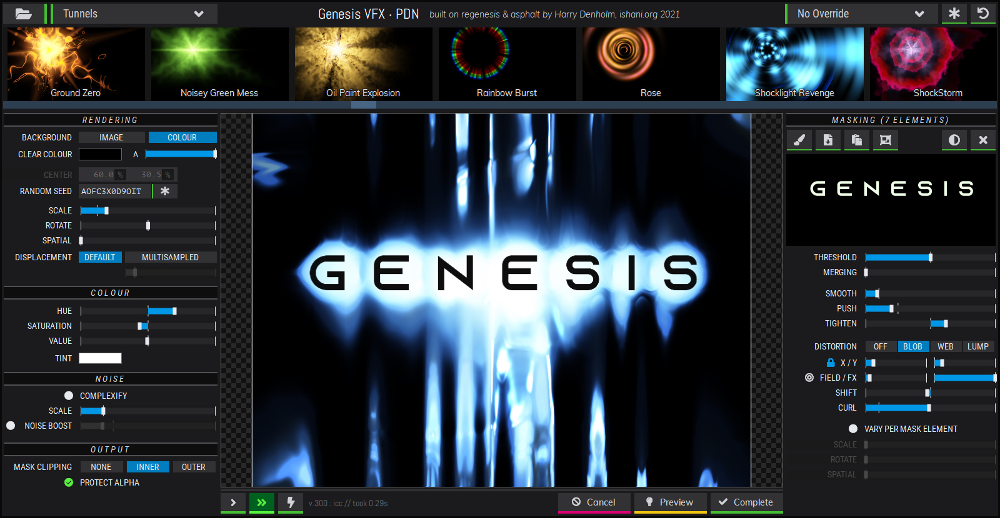
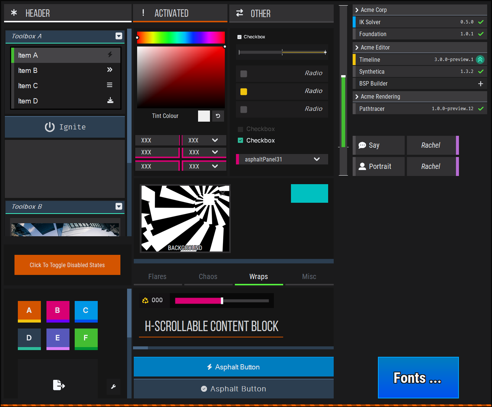
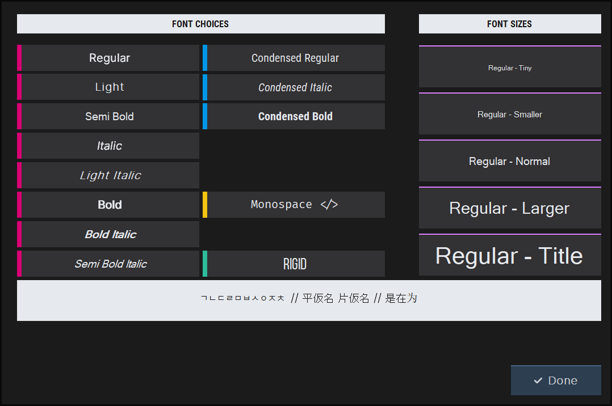
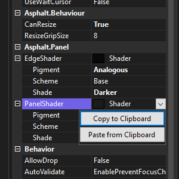
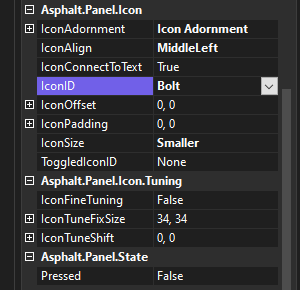

# Asphalt

Born out of non-specific boredom and frustration with the free custom control libraries available for WinForms, Asphalt is an offbeat collection of tools that could be conceivably used to build a user interface. And hey! It was, for my Paint.NET plugin [regenesis](https://github.com/ishani/GenesisVFX)

As a dinosaur, I still use WinForms sometimes as it's just such a quick place to bang ideas or little ideas together - but I always hated how ugly things were out-of-the-box with the default, aging Win32 controls in play. Asphalt contains a bunch of bespoke-styled, fully custom-drawn controls with an attempt at unified styling via common presentation settings. It's less a "control library" though, more a kind of busy kitchen drawer full of bits you can plug together.

## Controls

Featuring!!

 * Buttons!
 * Sliders!
 * Colour Pickers That Look Cool
 * Container-y Scroll-y Things!

.. wait that doesn't sound like a lot does it? However, the philosophy was to build a flexible, multi-purpose **panel** that could act easily like buttons, radio or check-box variants, drop-downs, headers, collapsible headers, all sorts. 

Did that philosophy bear out? Mostly! 

Asphalt contains embedded fonts as part of the attempt at standardising style across elements, as well as a set of size grades. These are delivered in the separate `Asphalt.Fonts` library for design-time reasons and can be reasonably easily swapped out for different fonts.

## Design Time

Beyond simply being well behaved at design time, I tried to add some convenience methods for setting up unified styles - like 'Shader' values for configuring default colours which could be copy/pasted between controls inside Visual Studio. Things like icons are drawn from an embedded [FontAwesome](https://fontawesome.com/) with easy selection of images from parameter drop-downs and pixel-accurate shunting and alignment if you're feeling obsessive.

## And?

Why would anyone want or use this? Good question. I learned a lot from writing it and enjoyed building the *regenesis* UI using it but if I started over I'd make some major changes to better support colour & styling and better resolution scalability. 

Still, there are some useful lessons in here if you're attacking writing some WinForms controls yourself, namely:

 * How to properly support embedded fonts in a control library that also works at Visual Studio design time (nightmare)

 * How to "Properly" render text on WinForm controls (minor nightmare)

 * Doing fun design-time things with `UITypeEditor` and how to best expose things to Visual Studio's slightly ropey parameter view

 * How to over-complicate a style/theme system
